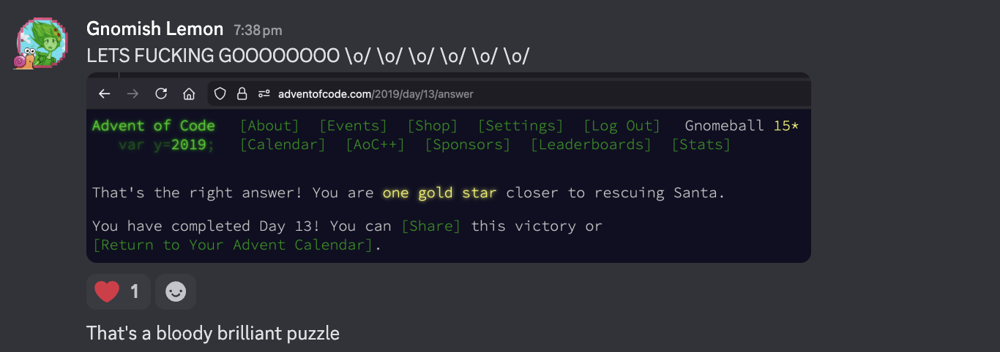

### 2019

Didn't actually do these in 2019, most were done as warm up puzzles

* Day 7 part 2 confuses the fuck out of me, I know what needs doing, and can manually run the example, but actually implementing it in code will take me some thinking

* Day 9 was an interesting addition to the IntCocde VM

* Day 13 was both incredibly challenging and supremely rewarding when I worked out the trick, the image below speaks volumes

* Day 17 ? Maybe ..